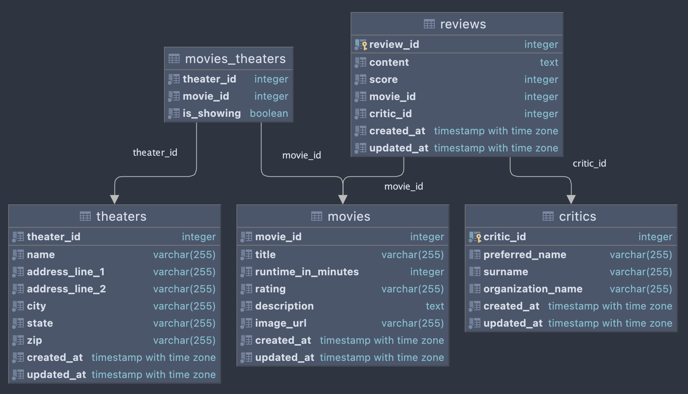

# Capstone Project: WeLoveMovies

**Note:** This application is deployed on Heroku. Fetching data may take a few
seconds while Heroku spins up the server.

:link: <a href='https://client-welovemovies.herokuapp.com/'>Click to see the app
in your browser!</a>
## About Me:
- My name is Mad, you can think of it as "Maude" or "Mod" in your head,
  whichever works!
- I'm currently enrolled in Thinkful's Fullstack Software Engineering course &
  having a really great time learning this material. I also earned my BA in
  Spanish Studies & Computer Science from Texas State University (*magna cum
  laude* woot woot!) in the winter of 2021, so I was fortunate to have a good
  foundation of programming knowledge going into this course. 
- This bootcamp is wrapping up at the beginning of May 2022, so please feel free
  to reach out if you've got me in mind for a junior developer role! 

My [🌲 LinkTree🌲 ](https://linktr.ee/madgodinez) has the best ways to find me
online, as well as my resume. 

## About the Project: WeLoveMovies
### Project Description:

"You've been hired on as a backend developer at a new startup called
WeLoveMovies! As another developer works on the design and frontend experience,
you have been tasked with setting up a database and building out specific routes
so that users can gain access to data about movies, theaters, and reviews."

### Routes:
| Path 
(starting at the trailing '/')
  | Description   |
| ---------------- | ---------------------------------------------------------------- |
| `/ `  | Homepage :house: Shows all movies currently playing in theaters.      |
| `/movies ` | All Movies :movie_camera: Shows a list of all movies on record.   |
| `/theaters ` | All Theaters :clapper: Shows a list of all movie theaters & their addresses.   |
| `/movies/# ` | Movie Details & Reviews :newspaper: For movie number where '#' is between 1 & 16, inclusive; shows its summary, runtime, maturity rating, average review score, where it's being shown, & the reviews for the movie.   |

### The Application's Tech Stack & Tools:

Development:

  - **Production Tier / Frontend:** JavaScript, HTML, CSS, React.js, Bootstrap,
    Visual Studio Code
  - **Application Tier / Backend:** JavaScript, Express.js (+Express
    [CORS](https://www.npmjs.com/package/cors)), Knex.js 
  - **Data Tier / Database:** PostgreSQL, JetBrains DataGrip, Postman 
  

Deployment:

 - Heroku, Github, git 
### Learning Objectives: 
This project is designed to test my ability to build complex servers and access
data through a database. To succeed at this project, I needed to demonstrate
that I could do the following:

- Install and use common middleware packages
- Receive requests through routes
- Run tests from the command line
- Access relevant information through route and query parameters
- Create an error handler for the case where a route doesn't exist
- Build an API following RESTful design principles
- Create and customize a knexfile.js file
- Create a connection to your database with Knex
- Write database queries to complete CRUD routes in an Express server
- Return joined and nested data with Knex
- Write database migrations using Knex's migration tool
- Deploy my new backend server to a cloud service
- Connect a frontend repo with a different author to my project successfully

### The Database's Structure:
Take a look at my PostgreSQL schema's Entity Relationship Diagram (ERD), minus
Knex migration tables.

  

---
### Optional Installation:
*Prerequisites: node v16.13.0 (npm v8.1.0)*
1. Fork this repository by clicking the Fork button at the top right of the
   page.
2. Clone this repository.
3. `cd` into the newly created directory.
   
    *The following commands are to be run in the project's root directory...*

4.  Run `npm install`. This will download the project's packages.
5.  Run `npm start`.
6.  To SEED Data: run `npm run seed`. This will seed the database. Can be run
    multiple times.
7.  To RESET Data: run `npm run reset`. This will rollback, migrate, & seed the
    database. 

Running `npm start` will open the app in your browser.

### Existing files:

This repository is set up as a "monorepo", meaning that the client and backend
projects are in one repository. This allows you to open both projects in the
same editor.

The table below describes the folders in this repository:

| Folder/file path | Description                                                      |
| ---------------- | ---------------------------------------------------------------- |
| `./backend-WLM`  | The backend project: https://backend-welovemovies.herokuapp.com/ |
| `./frontend-WLM` | The frontend project: https://client-welovemovies.herokuapp.com/ |

